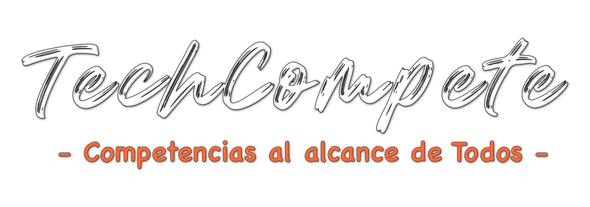

## Tecnologías Utilizadas

- Laravel
- PHP
- Blade
- JavaScript

## Instalación

Asegúrate de tener [Composer](https://getcomposer.org/) y [Node.js](https://nodejs.org/) instalados.

```bash
# Clona el repositorio y accede a la rama específica
git clone https://github.com/AlexHD220/SOLACYT.git
cd SOLACYT
git checkout tablaAsesoresP3

# Instala las dependencias de Composer
composer install

# Configura el archivo .env
cp .env.example .env
php artisan key:generate

# Ejecuta las migraciones y semillas
php artisan migrate:fresh
php artisan db:seed

# Instala las dependencias de Node.js y compila los assets
npm install
npm run build

# Crea el enlace simbólico para el almacenamiento
php artisan storage:link