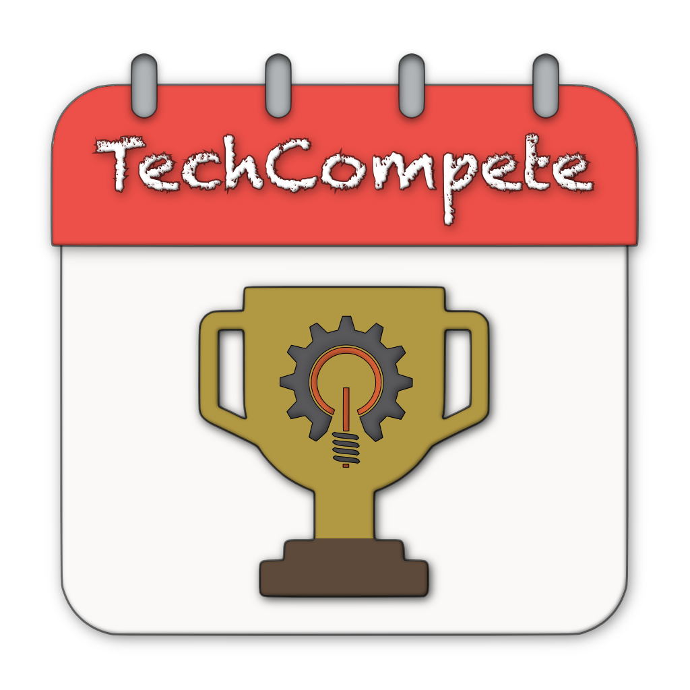

## Integrantes

- Hernández Dávila Alejandro (217525425)
- Núñez Nuño Roberto (217483803)
- Olivares Benítez Isidro Ismael (217415999)

## Tecnologías Utilizadas

- Laravel
- PHP
- Blade
- JavaScript

## Requisitos previos

Este proyecto está configurado para ejecutarse con [Laragon](https://laragon.org/).

Laragon es un entorno de desarrollo local liviano que incluye herramientas como Apache, MySQL, PHP y Node.js.

Asegúrate de tener instalados los siguientes programas:

- [PHP](https://www.php.net/) >= 8.2
- [Composer](https://getcomposer.org/)
- [MySQL](https://www.mysql.com/)
- [Node.js](https://nodejs.org/)

## Instalación de Laragon

1. Descarga Laragon desde su sitio oficial: [Descargar Laragon](https://laragon.org/download/).
2. Instálalo y asegúrate de seleccionar las herramientas necesarias (Apache, MySQL, PHP, Node.js).
3. Asegúrate de que el servicio de Laragon esté en ejecución.

## Implementación del proyecto

```bash
# Desde la Terminal de Laragon clona el repositorio en la carpeta raíz (C:\laragon\www)
git clone https://github.com/AlexHD220/TechCompete.git

# Accede a la carpeta del proyecto dentro de la Terminal (C:\laragon\www\TechCompete)
cd TechCompete

# Verifica que estas en la rama "main"
git branch

# Instala las dependencias de Composer
composer install

# Configura el archivo .env
cp .env.example .env
php artisan key:generate

# Crea la base de datos MySQL
mysql -u root -p
CREATE DATABASE techcompete;
[Presiona Enter]
exit 

# Edita el archivo .env para configurar las credenciales de la base de datos de Laragon (MySQL)
DB_CONNECTION=mysql
DB_HOST=127.0.0.1
DB_PORT=3306
DB_DATABASE=techcompete
DB_USERNAME=root
DB_PASSWORD=

# Ejecuta las migraciones y semillas
php artisan migrate
php artisan db:seed

# Instala las dependencias de Node.js y compila los assets
npm install
npm run build

# Instala Guzzle y actualiza las dependencias necesarias para enviar peticiones al servidor Flask
composer require guzzlehttp/guzzle -W

# Crea el enlace simbólico para el almacenamiento de archivos
php artisan storage:link

# Reinicia el servidor
Deten el servicio de Laragon y vuelve a ejecutarlo desde la aplicacion para generar el dominio.

# Accede al proyecto desde tu navegador
Laragon creará automáticamente un dominio local con la siguiente ruta.
http://techcompete.test

# Inicia sesión como Superusuarios dentro de la palataforma
El proyecto generará automaticamente en la base de datos el primer usuario con permisos de Superadministrador.
Para iniciar sesión utiliza las siguientes credenciales.
- Correo electrónico: superadmin@techcompete.com
- Contraseña: Pruebas.tc23